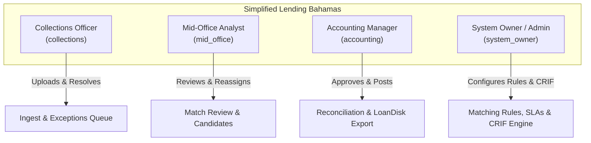
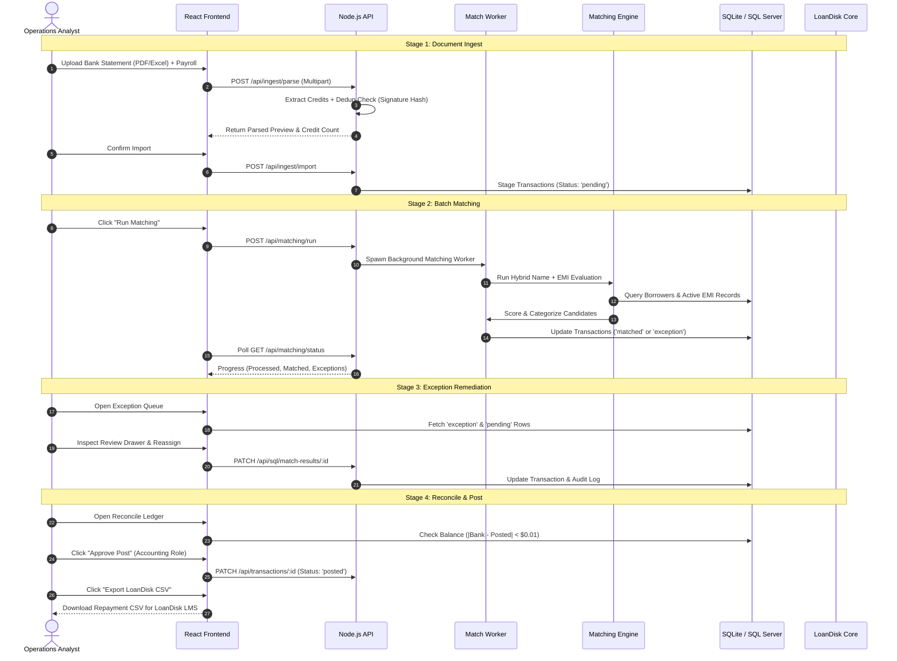
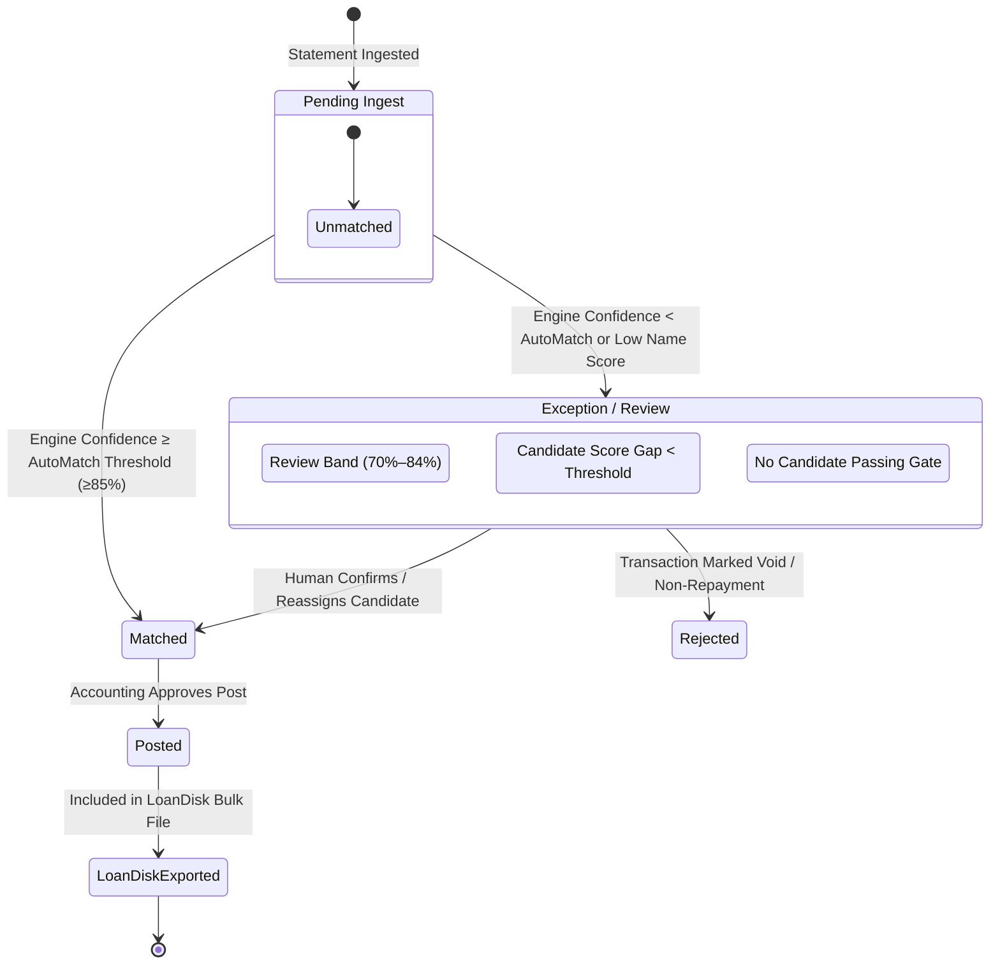
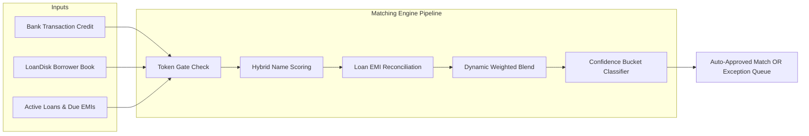

# Product Requirements Document (PRD)
## SmartRepay AI — Loan Repayment Reconciliation & Regulatory Compliance Platform

---

### Document Control & Metadata

| Attribute | Details |
| :--- | :--- |
| **Product Name** | **SmartRepay AI** |
| **Client / Organization** | **Simplified Lending Bahamas** |
| **Technology Partner** | **Graylogic Technologies** |
| **Document Version** | 1.0.0 (Production Release Baseline) |
| **Document Status** | Approved / Active Baseline |
| **Effective Date** | June 2026 / Local Execution 2026-09-09 |
| **Target Audience** | Executive Leadership, Collections Managers, Mid-Office Operations, Accounting & Finance, Systems Engineers, Compliance Officers |
| **Primary Repositories** | Frontend & Backend Monorepo (`smart-repay` / `smartrepay-server`) |
| **Core Systems Integrated** | **LoanDisk LMS** (Core Banking), **Microsoft SQL Server** (`Simplified_db`), **CRIF Credit Bureau (Bahamas)**, **OpenRouter AI Gateway**, **Microsoft Entra ID (Azure AD)** |

---

## 1. Executive Summary & Product Vision

### 1.1 Executive Summary
**SmartRepay AI** is an enterprise-grade loan repayment reconciliation, exception remediation, and credit reporting automation platform engineered specifically for **Simplified Lending Bahamas**. 

In high-volume retail and SME lending environments, borrowers submit loan repayments through fractured, multi-channel financial rails—including commercial bank wire/ACH transfers (RBC Royal Bank, Scotiabank Bahamas, CIBC FirstCaribbean, Commonwealth Bank, Bank of The Bahamas), third-party employer payroll deduction lists (e.g., Cable Bahamas, Inline Project, government ministries), and direct branch collections (walk-ins, WhatsApp receipts, and email payment proofs). 

Historically, matching these disparate statement credits against active loan accounts required laborious manual inspection across disconnected spreadsheets and the **LoanDisk** core loan management system (LMS). Common real-world discrepancies—such as truncated Bahamian names, middle-name omissions, inverted surname order, company trading aliases, and bulk payroll payments—caused high exception rates, delayed repayment posting, elevated delinquency false positives, and operational bottlenecks.

**SmartRepay AI** automates this entire reconciliation loop through a guided four-stage workflow:
1. **Multi-Format Ingest & AI Column Normalization**: Ingesting bank PDFs, payroll Excel/CSV files, and scanned payment receipts with automated deduplication.
2. **Hybrid Multi-Tier Matching Engine**: Combining tokenized name similarity algorithms (Jaro-Winkler, Damerau-Levenshtein, Double Metaphone, Levenshtein) with precise loan EMI amount reconciliation.
3. **Exception Resolution & SLA Tracking**: An interactive investigation drawer allowing analysts to confirm, reassign, or reject flagged payments within predefined SLA windows.
4. **Reconciliation, Dual-Control Posting & LoanDisk Sync**: Ensuring perfect balance between bank credits and ledger postings, generating automated LoanDisk import exports, and synchronizing regulatory records with **CRIF Credit Bureau Bahamas**.

### 1.2 Product Vision
To establish an autonomous, zero-leakage repayment reconciliation and regulatory reporting backbone for Simplified Lending Bahamas that cuts reconciliation cycle times from days to minutes, eliminates human attribution error, maintains an immutable compliance audit trail, and scales lending operations effortlessly.

---

## 2. Problem Statement & Business Objectives

### 2.1 Current Operational Pain Points
1. **Unstructured & Ambiguous Payment Particulars**: Bahamian bank statements often format payment narrations unpredictably (e.g., `DEP 104829 WILBERSON SMITH | SALARY DED`, `MOSS, CLIFFORD J / LOAN PMT`, or `INLINE PROJECT / EMP# 4022`). Standard exact-match queries fail against formal borrower records in LoanDisk (e.g., `Wilberson Wilberforce Smith`).
2. **False-Positive Matching Risks**: Simplistic fuzzy string algorithms often link borrowers sharing identical common Bahamian surnames (e.g., matching `Wilberson Smith` to `Annalisa Deandra Smith` due to surname weight). A strict multi-token gate is mandatory to prevent misallocated funds.
3. **Fragmented Repayment Channels**: Offline and conversational payments (walk-in cash/cheques, WhatsApp image receipts, customer service email slips) exist outside electronic bank statements and require manual data re-entry.
4. **Manual LoanDisk Repayment Posting**: Reconciled payments previously required manual line-by-line entry into LoanDisk, creating backlog and human data-entry risks.
5. **Bahamian Credit Bureau (CRIF) Regulatory Burden**: Under Bahamian regulatory statutes, lenders must report detailed monthly borrower demographics (`Subject`) and credit contract statuses (`Contract`) to CRIF. Generating compliant, fixed-width ASCII files with 70+ demographic columns and 50+ loan lifecycle columns has traditionally been prone to schema validation failure.

### 2.2 Core Business Objectives & Key Performance Indicators (KPIs)

| Objective | Baseline (Manual) | Target (SmartRepay AI) | Measurement Metric |
| :--- | :--- | :--- | :--- |
| **Straight-Through Match Rate** | 25% – 35% | **≥ 85% – 92%** | % of bank credits auto-matched with zero manual intervention |
| **Reconciliation Turnaround Time** | 4 – 8 Business Hours | **< 15 Minutes** | Time from bank statement receipt to LoanDisk post-ready export |
| **Exception Remediation SLA** | 48 – 72 Hours | **< 24 Hours** | Time to resolve ambiguous or unmatched payment lines |
| **Posting Allocation Accuracy** | ~96.5% | **99.99%** | Zero misattributed borrower payments |
| **CRIF Regulatory Submission** | 3 – 5 Days / Month | **1-Click Generation (<5 min)** | Zero schema rejections on CRIF regulatory portal |
| **Operational Scalability** | Max 1,000 tx/day/analyst | **> 20,000 tx/batch** | System throughput capacity without team headcount expansion |

---

## 3. User Personas & Role-Based Access Control (RBAC)

SmartRepay enforces strict four-tier Role-Based Access Control (RBAC) integrated with enterprise SSO (**Microsoft Entra ID**) and local fallback authentication.

### 3.1 User Personas



#### 1. Collections Officer (`collections`)
* **Focus**: Daily statement ingestion, monitoring incoming credit feeds, logging walk-in/WhatsApp payment receipts, and verifying borrower details for unmatched payments.
* **Key Tasks**: Uploading bank/employer files; entering manual receipts; reviewing unmatched exception queues.

#### 2. Mid-Office Analyst (`mid_office`)
* **Focus**: Investigation of ambiguous candidate matches, verifying borrower identities against loan documents, and reassigning edge-case transactions.
* **Key Tasks**: Evaluating review-tier candidates (70%–84% confidence); reviewing borrower loan ledgers; validating repayment proofs.

#### 3. Accounting & Finance Officer (`accounting`)
* **Focus**: Final fiscal balance verification, verifying bank credit totals against posted batches, approving final ledger entries, and generating LoanDisk bulk import files.
* **Key Tasks**: Ledger reconciliation; approving postings; downloading LoanDisk CSV exports; reviewing daily financial summaries.

#### 4. System Owner / Administrator (`system_owner`)
* **Focus**: Platform tuning, algorithm weight configuration, SLA policy enforcement, CRIF credit bureau generation, SQL Server synchronization, and user administration.
* **Key Tasks**: Tuning matching thresholds (Jaro/Levenshtein/Metaphone weights, name vs amount share); managing SLA escalation rules; triggering SQL syncs; running CRIF regulatory file generators.

### 3.2 RBAC Permissions Matrix

| Platform Capability | Collections (`collections`) | Mid-Office (`mid_office`) | Accounting (`accounting`) | System Owner (`system_owner`) |
| :--- | :---: | :---: | :---: | :---: |
| **Statement Ingestion (PDF, Excel, CSV, Image)** | ✅ | ✅ | ✅ | ✅ |
| **Run Batch Matching Engine** | ✅ | ✅ | ✅ | ✅ |
| **Manual Receipt Entry & Upload** | ✅ | ✅ | ✅ | ✅ |
| **Exception Resolution (Confirm / Reassign / Reject)** | ✅ | ✅ | ✅ | ✅ |
| **View Active Loans & Loan Statements** | ✅ | ✅ | ✅ | ✅ |
| **Export Transaction & Exception Reports** | ✅ | ✅ | ✅ | ✅ |
| **Post Approval (Bank Credit -> Posted Ledger)** | ❌ | ❌ | ✅ | ✅ |
| **Generate & Download LoanDisk Export CSV** | ❌ | ❌ | ✅ | ✅ |
| **Configure SLA Durations & Auto-Escalation** | ❌ | ❌ | ❌ | ✅ |
| **Tune Matching Rules & Confidence Sliders** | ❌ | ❌ | ❌ | ✅ |
| **Trigger Full LoanDisk -> SQL Server Sync** | ❌ | ❌ | ❌ | ✅ |
| **CRIF Regulatory File Generation & Node Data** | ❌ | ❌ | ❌ | ✅ |
| **System Data Reset & Audit Purge** | ❌ | ❌ | ❌ | ✅ |

---

## 4. End-to-End System Workflows & State Machines

### 4.1 The Core 4-Step Reconciliation Workflow



### 4.2 Transaction State Machine

Every ingested transaction moves through strict, auditable lifecycle states:



### 4.3 Content Signature & Deduplication Lifecycle
To prevent double-counting payments across overlapping statements or re-uploaded files, SmartRepay calculates an immutable, normalized content signature:
$$\text{Signature} = \text{DateKey}(\text{Date}) \parallel \text{Trim}(\text{Reference}) \parallel \text{Normalize}(\text{BorrowerName}) \parallel \text{Format}(\text{Amount}, 2)$$
* **Hash Enforcement**: SQLite and SQL Server maintain unique indexing on `import_hash`. Duplicate rows are identified in real-time during ingestion preview and filtered out automatically.

---

## 5. Detailed Functional Specifications by Module

---

### Module 1: Multi-Format Statement Ingestion & AI Parsing

#### 1.1 Scope & Capabilities
The Ingestion subsystem processes heterogeneous financial documents from commercial banks, corporate employers, and retail branches.

```
Supported Input Document Types:
├── Bank Statements (PDF)
│   ├── Bahamas Bank PDF Balance-Delta Credit Extraction
│   ├── Pipe-delimited particulars parsing ("TXN_DESC | PAYER_NAME | REF")
│   └── Fallback: Positive transaction amount detection
├── Bank & Employer Spreadsheets (Excel / CSV)
│   ├── Supported Extensions: .xlsx, .xls, .xlsm, .csv
│   ├── Standard Bank Profiles: RBC, Scotiabank, CIBC FirstCaribbean, BOB
│   └── Header Alias Mapping: Date Posted, Value Date, Beneficiary, Reference, Credit Amount
├── AI-Assisted Non-Standard Document Parsing (OpenRouter API)
│   ├── Vision / LLM column alignment for unformatted employer payrolls
│   └── Configurable Model: nvidia/nemotron-3-nano-omni-30b-a3b-reasoning (or DeepSeek/GPT-4o)
└── Scanned Documents & Payment Slips (PNG, JPG, WebP)
    └── OCR and AI key-value field extraction
```

#### 1.2 Functional Requirements
* **Batch Uploading**: Supports dragging and dropping up to **10 files simultaneously**. Each file undergoes isolated worker parsing.
* **Balance-Delta PDF Analysis**: For standard Bahamian bank statements, credits are identified by calculating balance differences ($\Delta \text{Balance} > 0$) or parsing explicit credit columns (`CR`, `Credit`, `Deposit`).
* **Pipe-Delimited Narration Extraction**: Automatic decomposition of Bahamian wire strings (e.g., `PAYROLL DED | CABLE BAHAMAS | REF# 99401` $\rightarrow$ Narration: `PAYROLL DED`, Payer: `CABLE BAHAMAS`, Reference: `REF# 99401`).
* **Ingest Preview & Staging Queue**:
  * Displays parsed row count, credit transaction count, total monetary value, and duplicate detection warnings.
  * Allows users to cancel or confirm commit to staging.
* **Document Deletion & Cascade Rollback**: System owners can delete uploaded documents, triggering a cascade rollback of staged rows and non-posted candidate matches from SQL Server and SQLite.

---

### Module 2: The Intelligent Hybrid Matching Engine

#### 2.1 Engine Architecture & Mathematics
The SmartRepay Matching Engine solves the Bahamian lender naming problem through a multi-tier pipeline combining phonetics, token permutations, string metrics, and financial EMI reconciliation.



#### 2.2 Hybrid Name Scoring Algorithm
The name engine tokenizes and normalizes names (removing titles, salutations, punctuation, and sorting tokens). First and last name tokens are evaluated using a four-algorithm weighted blend:

$$\text{Score}_{\text{token}} = (0.45 \times \text{Jaro-Winkler}) + (0.30 \times \text{Damerau-Levenshtein}) + (0.15 \times \text{Double Metaphone}) + (0.10 \times \text{Levenshtein})$$

1. **Jaro-Winkler (45% weight)**: Highly sensitive to matching prefixes and transposed characters.
2. **Damerau-Levenshtein (30% weight)**: Detects character insertions, deletions, substitutions, and transpositions.
3. **Double Metaphone (15% weight)**: Evaluates Bahamian phonetic pronunciation equivalence (sound-alike names).
4. **Levenshtein Similarity (10% weight)**: Absolute edit-distance ratio.

#### 2.3 Strict Multi-Token Gate (Wilberson Smith Protection)
* **Problem**: Common surnames (e.g., Smith, Johnson, Rolle, Moss) create false positive matches when payer names contain only 2 tokens.
* **Engine Rule**: When the input bank/payroll name has $\ge 2$ tokens:
  * **Last-name-only matching is strictly disabled**.
  * **First-name-only matching is strictly disabled**.
  * Both first and last tokens must independently clear the **Typo Similarity Floor** ($\ge 0.70$).
  * Subset token matches require the **first token** to agree.
  * If the gate fails, the name score is forced to **0**, classifying the candidate as `different_person`.

#### 2.4 Amount Reconciliation Permutations
Credit amounts are matched against the borrower’s active loan portfolio:

| Match Category | Criteria | Component Score |
| :--- | :--- | :---: |
| **Exact Single EMI** | $| \text{Amount} - \text{Loan.EMI} | \le \text{Tolerance}$ ($\pm 2\%$ default) | **100** |
| **Sum of All Loans** | $| \text{Amount} - \sum \text{Loans.EMI} | \le \text{Tolerance}$ | **100** |
| **Subset of Loans** | Amount exactly equals the sum of a specific combination of active loans | **100** |
| **Partial Payment** | $0 < \text{Amount} < \text{Loan.EMI}$ (Valid borrower, but incomplete payment) | **55** |
| **Amount Mismatch** | $\text{Amount} > \text{Loan.EMI}$ or random non-reconciling variance | **25** |
| **No Amount Data** | Borrower has zero active EMI schedules | **10** |

#### 2.5 Dynamic Confidence Blend & Classification
Final match confidence blends Name Score and Amount Score according to administrator-configured weights:

$$\text{Final Confidence} = (W_{\text{Name}} \times \text{NameScore}) + (W_{\text{Amount}} \times \text{AmountScore})$$
*(Constraint: $W_{\text{Name}} + W_{\text{Amount}} = 1.0$; Defaults: $W_{\text{Name}} = 0.60$, $W_{\text{Amount}} = 0.40$)*

**Confidence Buckets**:
* **Same Person ($\ge 95\%$)**: Auto-matched. Full name match with exact EMI reconciliation.
* **Very Likely Match ($85\% – 94\%$)**: Auto-approved or fast-tracked. High-confidence candidate.
* **Needs Review ($70\% – 84\%$)**: Routed to human Exception Queue. First + last pass, but amount varies or secondary token confidence is moderate.
* **Different Person ($< 70\%$)**: Rejected. Name gate failed or below threshold.

#### 2.6 OpenRouter AI Ambiguity Adjudication (Optional)
When two candidate borrowers have confidence scores within the **Ambiguity Gap** (default: 8 points), the system can dispatch an asynchronous prompt to OpenRouter to analyze contextual particulars and determine the intended borrower.

---

### Module 3: Exception Queue & SLA Tracking

#### 3.1 Exception Management Interface
Transactions that do not meet auto-match criteria are routed to `/exceptions`.
* **Dynamic Filtering**: One-click toggles for `Needs action`, `Unmatched`, `Needs review`, and `All`.
* **Universal Search**: Real-time filtering across payer name, transaction description, matched borrower, reference ID, and source filename.

#### 3.2 Side-by-Side Review Drawer
Clicking an exception opens an investigation drawer providing:
* Raw bank statement transaction details (date, amount, reference, particulars).
* Top candidate borrowers ranked by confidence score.
* Field-level breakdown: Name Score %, Token Alignment Reason, Expected EMI, Loan Status.
* Borrower's complete loan book and historical repayment ledger.
* Actions:
  * **Confirm Match**: Assigns transaction to selected candidate.
  * **Reassign Borrower**: Search directory by name or LoanDisk ID to manually associate.
  * **Mark as Exception / Reject**: Flags line as non-repayment, deposit return, or fee.

#### 3.3 SLA Configuration & Breach Escalation
* Configurable response windows per exception type:
  * `unmatched`: 24h default (options: 4h, 24h, 48h, 72h)
  * `duplicate`: 24h default
  * `partial`: 48h default
  * `suspicious`: 4h default
* **Auto-Escalation Engine**: Automatically flags transactions breaching SLA limits, displaying visual warning badges and alerting supervisors.

---

### Module 4: Reconciliation, Post Approval & LoanDisk Export

#### 4.1 Financial Ledger Balancing
The `/reconcile` module guarantees ledger integrity prior to core LMS update.
* **Group by Statement Date**: Groups all transactions by value date.
* **Real-Time Balancing Metric**:
  $$\text{Discrepancy} = \sum \text{Bank Credit Amounts} - \sum \text{Posted Amounts}$$
  * Status is **Balanced** when $|\text{Discrepancy}| < \$0.01$.
  * Visual status indicator alerts the user if unreconciled transactions remain.

#### 4.2 Dual-Control Human Approval
* In adherence to banking internal controls, **only users with `accounting` or `system_owner` roles can approve posts**.
* Posting commits the transaction to the official internal ledger (`status = 'posted'`).

#### 4.3 LoanDisk Repayment Export Generation
* Generates a LoanDisk LMS-compliant CSV file containing:
  * `Loan ID / Loan Number`
  * `Borrower ID`
  * `Repayment Date`
  * `Repayment Amount`
  * `Payment Method` (Bank Wire, ACH, Payroll Deduction, Cash)
  * `Reference Number / Particulars`
* Direct download modal allowing preview of records before file generation.

---

### Module 5: Borrower & Loan Book Synchronization

#### 5.1 Dual-Store Architecture
SmartRepay operates a synchronized dual-store architecture:
1. **Local SQLite (`smartrepay.db`)**: Ultra-low latency operational cache for UI queries, real-time matching, and session staging.
2. **Microsoft SQL Server (`Simplified_db`)**: Enterprise central database storing permanent records in SIL tables:
   * `SILBorrowers`: Borrower demographics, NIB, employer, branches.
   * `SILLoans`: Active loan contracts, interest rates, balances, child status.
   * `SILloanrepayments`: Historical repayments ledger.
   * `Staging_LoandiskDueRecords`: Dynamic index of expected EMI schedules.

#### 5.2 Synchronization Guarantees
* **Append / Upsert Only**: Synchronization jobs **never truncate or delete** existing SQL Server tables.
* **Scheduled Cron Sync**: Built-in background cron scheduler (`node-cron`):
  ```env
  LOANDISK_SYNC_ENABLED=true
  LOANDISK_SYNC_CRON=0 2 * * 0  # Every Sunday at 02:00 UTC
  ```
* **Manual On-Demand Sync**: One-click **Sync to SQL Server** trigger available on the Borrowers view.

---

### Module 6: Manual Receipts & Multi-Channel Payment Tracking

#### 6.1 Purpose & Use Cases
Captures payments collected outside commercial banking statements:
* Walk-in cash/cheque payments at branch locations.
* Direct transfer receipts sent by borrowers via **WhatsApp**.
* Customer support email deposit slips.
* Telephone collections confirmed via debit card.

#### 6.2 Capabilities
* **Receipt Attributes**: Borrower name/ID, linked Loan number, payment date, amount, channel (`walkin`, `whatsapp`, `email`, `phone`), reference note.
* **Proof Attachment**: Direct file upload of receipt photos or PDF deposit slips stored securely on the server.
* **Integrated Ledger**: Appears instantly in loan statements and analytics alongside bank credits.

---

### Module 7: CRIF Credit Bureau Bahamian Regulatory Integration

#### 7.1 Regulatory Context (Bahamas Credit Reporting Act)
Simplified Lending Bahamas is legally mandated to report credit portfolios monthly to the **CRIF Credit Bureau (Bahamas)**. SmartRepay provides an integrated end-to-end subsystem to extract, validate, map, and export compliant records.

#### 7.2 Core CRIF Subsystems

```
CRIF Bureau Module (/crif)
├── Data Ingestion & Extraction
│   ├── Mode A: Direct LoanDisk API Automated Fetch
│   └── Mode B: Monthly Bulk Repayment Excel Upload
├── Database Staging & Normalization
│   ├── dbo.NodeCRIF_Subject (70 Demographics Columns)
│   └── dbo.NodeCRIF_Contract (50 Loan Performance Columns)
├── Execution Gateway
│   └── POST /SP/CRIF_Operations via HTTPS API Gateway (Firewall Bypass)
├── CRIF ASCII File Generator
│   ├── Fixed-length regulatory formatted records
│   ├── Configurable delimiters, line lengths, and ASCII codes
│   └── Secure attachment download proxy
└── Migration Logs & Exception Tracking
    ├── Subject/Contract error logs
    └── Failed records viewer with field-level correction guidance
```

#### 7.3 Data Field Mapping Specifications
* **Subject Record (70+ Fields)**: `HeaderRT`, `FICode`, `AccountingDate`, `FISubjectCode`, `FirstName`, `LastName`, `MiddleName`, `NIBNumber`, `Gender`, `DateOfBirth`, `MaritalStatus`, `AddressStreet`, `AddressCity`, `EmployerName`, `Occupation`, `GrossAnnualIncome`, `MobilePhone`, etc.
* **Contract Record (50+ Fields)**: `FIContractCode`, `ContractType`, `ContractStatus`, `Currency` (BSD), `StartDate`, `MaturityDate`, `FinancedAmount`, `MonthlyInstalmentAmount`, `OutstandingBalance`, `NumberPaymentsPastDue`, `AmountPastDue`, `DaysPastDue`, `WorstStatus`, etc.

---

### Module 8: Analytics, Executive Dashboards & Daily Reporting

#### 8.1 Dashboard Intelligence
The unified `/dashboard` provides executive visibility into:
* **Pipeline Funnel**: Documents Ingested $\rightarrow$ Transactions Staged $\rightarrow$ Auto-Matched $\rightarrow$ Human Reviewed $\rightarrow$ Posted.
* **Matching Algorithm Quality**:
  * Distribution of Confidence Buckets (Same Person, Very Likely, Review, Different Person).
  * Breakdown of Name Score Tiers (100, 90–99, 70–89, <70).
  * Breakdown of Amount Match Kinds (Exact Single, Sum All, Subset, Partial, Mismatch).
  * Root-Cause Analysis for Exceptions (Name Gate Failed, EMI Mismatch, Low Confidence).
* **Portfolio Repayment Health**:
  * Active Borrowers & Loans tracked.
  * Delinquency rating buckets (Excellent, On Track, At Risk, Overdue, Delinquent).
* **7-Day Rolling Volume Trends**: Bar and area charts of matched vs unmatched volumes.

#### 8.2 Daily Summary Report
* `/reports/daily` compiles daily operations:
  * Total transactions processed and monetary value.
  * Count of posted vs pending vs exception lines.
  * SLA Compliance % rating.
  * One-click **Print** (clean print-stylesheet formatting) and **Send Report** distribution.

---

### Module 9: Enterprise Audit Logging & Governance

#### 9.1 Immutable Audit Trail
Every state change within SmartRepay is recorded in `audit_log`:
* **Entity**: `transaction`, `exception`, `borrower`, `receipt`, `loandisk`, `settings`, `demo`.
* **Entity ID**: Targeted unique identifier.
* **Action**: `update`, `confirm_match`, `reassign`, `human_post_approved`, `sync_sql`, `save_rules`, etc.
* **Actor**: User email address extracted from verified JWT / MSAL token.
* **Prior vs New Value**: Full JSON snapshots capturing exact before-and-after state diffs.
* **Timestamp**: UTC ISO-8601 recorded at server level.
* **Search & Filter**: Accessible at `/audit` for internal and external banking compliance reviews.

---

## 6. System Architecture & Technical Specifications

### 6.1 Architectural Topology

```mermaid
graph TB
    subgraph ClientTier ["Client Browser (SPA)"]
        ReactApp["React 19 SPA (Vite + Tailwind CSS v4)"]
        Router["HashRouter / Routes"]
        MSALClient["@azure/msal-browser (Entra ID)"]
    end

    subgraph APITier ["SmartRepay Application Server (Node.js)"]
        Express["Express 4 API Server (:3001)"]
        AuthMiddleware["JWT & Azure Token Validator"]
        IngestService["Statement Ingest & PDF Parser"]
        MatchWorker["Background Job Runner (Worker Child Process)"]
        SyncScheduler["node-cron Sync Scheduler"]
        LocalDB["SQLite 3 Database (WAL Mode)<br/>smartrepay.db"]
    end

    subgraph IntegrationTier ["External & Core Banking Services"]
        MeanhostGateway["Meanhost API Gateway (HTTPS)<br/>/SP/CRIF_Operations"]
        SqlServer["Microsoft SQL Server<br/>Simplified_db (SIL Tables & CRIF)"]
        LoanDiskAPI["LoanDisk LMS REST API"]
        OpenRouter["OpenRouter AI Gateway (Nemotron/DeepSeek)"]
        EntraID["Microsoft Entra ID (slendingbahamas.com)"]
    end

    ReactApp -->|REST / JSON| Express
    MSALClient -->|OAuth 2.0 / OIDC| EntraID
    Express --> AuthMiddleware
    Express --> IngestService
    Express --> MatchWorker
    Express --> LocalDB
    MatchWorker --> LocalDB

    Express -->|HTTPS Bearer| MeanhostGateway
    MeanhostGateway --> SqlServer
    Express -->|Direct TCP (Optional)| SqlServer
    Express -->|HTTPS REST| LoanDiskAPI
    Express -->|HTTPS Streaming| OpenRouter
```

### 6.2 Technology Stack

| Layer | Component | Technology | Version / Specification |
| :--- | :--- | :--- | :--- |
| **Frontend** | Framework | React | 19.0.0 |
| | Bundler / Tooling | Vite | 6.2.0 |
| | Styling | Tailwind CSS | 4.0.9 |
| | UI Components | Radix UI Primitives | Latest (`dialog`, `dropdown`, `select`, `slot`) |
| | Visualizations | Recharts | 2.15.1 |
| | Icons | Lucide React | 0.475.0 |
| | Authentication | Azure MSAL Browser | 4.30.0 |
| **Backend** | Runtime | Node.js | >= 22.5.0 (ES Modules) |
| | Framework | Express | 4.21.2 |
| | File Ingestion | Multer, pdf-parse, xlsx | Multipart streaming, buffer extraction |
| | Local Caching DB | SQLite | Node native driver, WAL mode |
| | Background Jobs | Child Process / Workers | Dedicated worker pool for heavy matching |
| | Enterprise DB | Microsoft SQL Server | `mssql` 12.5.5 |
| | Security | Jose, jsonwebtoken, bcryptjs | RS256 / HS256 validation |
| | Scheduler | node-cron | 3.0.3 |
| **Deployment** | Containerization | Docker | Alpine / Node 22 slim |
| | Orchestrator | Coolify | Git-driven webhook CI/CD |
| | Build Pack | Dockerfile / Nixpacks | Multi-stage build with persistent volume |

### 6.3 Database Schema (Local SQLite - `smartrepay.db`)

```sql
-- Users & Roles
CREATE TABLE users (
  id TEXT PRIMARY KEY,
  email TEXT UNIQUE NOT NULL,
  password_hash TEXT NOT NULL,
  role TEXT NOT NULL DEFAULT 'collections' CHECK (role IN ('collections','mid_office','accounting','system_owner')),
  full_name TEXT,
  created_at TEXT DEFAULT (datetime('now'))
);

-- Borrowers Cache
CREATE TABLE borrowers (
  id TEXT PRIMARY KEY,
  full_name TEXT NOT NULL,
  first_name TEXT,
  last_name TEXT,
  loandisk_id TEXT UNIQUE,
  branch_id TEXT,
  branch_name TEXT,
  aliases TEXT, -- JSON Array
  employer TEXT,
  created_at TEXT DEFAULT (datetime('now'))
);

-- Loans Cache
CREATE TABLE loans (
  id TEXT PRIMARY KEY,
  borrower_id TEXT REFERENCES borrowers(id),
  loan_number TEXT UNIQUE NOT NULL,
  emi REAL,
  outstanding_balance REAL,
  status TEXT DEFAULT 'active',
  created_at TEXT DEFAULT (datetime('now'))
);

-- Transactions & Staged Credits
CREATE TABLE transactions (
  id TEXT PRIMARY KEY,
  date TEXT NOT NULL,
  payer TEXT,
  description TEXT,
  amount REAL NOT NULL,
  reference TEXT,
  status TEXT DEFAULT 'pending' CHECK (status IN ('pending','matched','exception','posted')),
  confidence_score REAL,
  matched_borrower_id TEXT REFERENCES borrowers(id),
  loan_id TEXT REFERENCES loans(id),
  source_document_id TEXT REFERENCES documents(id),
  import_hash TEXT UNIQUE,
  created_at TEXT DEFAULT (datetime('now'))
);

-- Exceptions Queue
CREATE TABLE exceptions (
  id TEXT PRIMARY KEY,
  transaction_id TEXT REFERENCES transactions(id),
  type TEXT CHECK (type IN ('unmatched','duplicate','partial','suspicious')),
  assigned_to TEXT,
  sla_hours INTEGER DEFAULT 24,
  status TEXT DEFAULT 'open' CHECK (status IN ('open','resolved','escalated')),
  resolution_note TEXT,
  resolved_at TEXT,
  created_at TEXT DEFAULT (datetime('now'))
);

-- Uploaded Statement Documents
CREATE TABLE documents (
  id TEXT PRIMARY KEY,
  filename TEXT NOT NULL,
  storage_path TEXT NOT NULL,
  file_size INTEGER,
  mime_type TEXT,
  document_type TEXT, -- 'bank' | 'employer' | 'spreadsheet' | 'image'
  uploaded_by TEXT,
  created_at TEXT DEFAULT (datetime('now'))
);

-- Immutable Compliance Audit Log
CREATE TABLE audit_log (
  id TEXT PRIMARY KEY,
  entity TEXT NOT NULL,
  entity_id TEXT,
  action TEXT NOT NULL,
  actor TEXT NOT NULL,
  prior_value TEXT, -- JSON
  new_value TEXT,   -- JSON
  created_at TEXT DEFAULT (datetime('now'))
);
```

---

## 7. Non-Functional Requirements (NFRs)

### 7.1 Performance & Throughput
* **Batch Processing Speed**: The matching worker must evaluate at least **2,500 transactions per minute** against a borrower book of 50,000 records.
* **UI Responsiveness**: All primary table grids (Transactions, Match Queue, Borrowers) must render with sub-100ms interaction latency utilizing virtualization and paginated querying.
* **Long-Running Job Safety**: Batch matching and SQL sync jobs execute in isolated worker processes. UI clients poll status endpoints (`/api/matching/status`), preventing HTTP timeout drops on large file imports. Hard safety job ceiling: 480,000ms.

### 7.2 Security & Compliance
* **Single Sign-On (SSO)**: Seamless authentication via Microsoft Entra ID restricting login to the `@slendingbahamas.com` tenant.
* **Session Management**: Cryptographically signed JWT tokens with 8-hour expiry.
* **Firewall Traversal**: All SQL Server stored procedure interactions route through an authenticated HTTPS API gateway (`meanhost.in`), ensuring the Coolify container cloud does not require opening external inbound TCP ports (1433/9933).
* **Data at Rest & Transit**: All network transit enforced over TLS 1.3. Local SQLite database file secured within container volume with restricted system permissions.

### 7.3 High Availability & Data Resilience
* **Persistent Storage Policy**: Docker volume mounted exclusively to `/app/server/data` preserving `smartrepay.db` and uploaded statement files across container updates and host redeployments.
* **Zero Data Loss Guarantee**: Sync routines to Microsoft SQL Server operate strictly via `MERGE` / `UPSERT`. No destructive `TRUNCATE` or `DELETE` commands are permitted on production SIL tables.

---

## 8. Deployment & Operational Runbook

### 8.1 Docker & Coolify Deployment Model
SmartRepay is deployed as a single unified container (serving both the compiled React Vite SPA and the Express backend) on **Coolify**:
* **Health Check Endpoint**: `GET /api/health`
* **Port**: `3001`
* **Persistent Volume Mount**:
  * Container Path: `/app/server/data`
  * Host Path: Coolify managed persistent volume

### 8.2 Environment Configuration Guide

```bash
# Server Port & Core Auth
PORT=3001
JWT_SECRET=production_random_secret_string_32_char_minimum

# AI Gateway (OpenRouter)
OPENROUTER_API_KEY=sk-or-v1-...
OPENROUTER_MODEL=nvidia/nemotron-3-nano-omni-30b-a3b-reasoning:free
OPENROUTER_SITE_URL=https://smartrepay.slendingbahamas.com
OPENROUTER_APP_NAME=SmartRepay AI
OPENROUTER_NITRO=true
MATCH_CONCURRENCY=8

# LoanDisk API Gateway
LOANDISK_API_URL=https://simplifiedapi.meanhost.in/v1/api
LOANDISK_USERNAME=api_admin
LOANDISK_PASSWORD=****************
LOANDISK_BORROWER_ID=4617884
LOANDISK_FETCH_TIMEOUT_MS=180000

# Automated Sync Scheduler
LOANDISK_SYNC_ENABLED=true
LOANDISK_SYNC_CRON=0 2 * * 0

# Microsoft Entra ID (SSO)
AZURE_TENANT_ID=slending-azure-tenant-guid
AZURE_CLIENT_ID=slending-client-id-guid
AZURE_CLIENT_SECRET=slending-azure-secret
AZURE_ALLOWED_DOMAIN=slendingbahamas.com
AZURE_DEFAULT_ROLE=collections

# Direct Enterprise SQL Server (Optional / Migrations)
DB_SERVER=185.136.157.11
DB_PORT=9933
DB_DATABASE=Simplified_db
DB_USER=Simplified_user
DB_PASSWORD=****************
DB_ENCRYPT=false
DB_TRUST_SERVER_CERT=true
```

---

## 9. Verification & Acceptance Testing Criteria

| Test Suite | Scenario | Expected Behavior | Acceptance Standard |
| :--- | :--- | :--- | :--- |
| **Ingest Engine** | Upload 10-page Bahamian bank PDF statement | Parse all credit lines; filter debits; extract pipe particulars; flag duplicates | 100% credit lines staged; 0 debit lines included |
| **Name Matching** | Payer: `Wilberson Smith`<br/>Candidates: `Wilberson Wilberforce Smith` vs `Annalisa Deandra Smith` | Multi-token gate eliminates `Annalisa Deandra Smith` (score 0); correctly matches `Wilberson Wilberforce Smith` | Zero false positive matches |
| **Name Typo** | Payer: `LINDA ISREAL`<br/>Candidate: `LINDA ISRAEL` | High-confidence match ($\ge 90\%$) via Jaro-Winkler + Damerau-Levenshtein | Match classified as `Same Person` or `Very Likely` |
| **Amount Matching** | Borrower has 2 active loans (EMI: $250.00 each); Payment amount: $500.00 | Reconciled via `Sum of All Loans` permutation (score 100) | Confidence reaches 100% with full name match |
| **RBAC Security** | Collections user attempts to approve post or change Matching Rules | System returns `403 Forbidden`; UI hides posting buttons and settings links | Strict role enforcement |
| **CRIF Generation** | Generate Subject & Contract ASCII files for 5,000 accounts | Produce valid fixed-width file; 0 formatting errors; direct browser download | Passed CRIF portal validation check |
| **SLA Escalation** | Unmatched transaction unresolved for > 24 hours | Transaction badge turns `Breached`; highlighted in red on dashboard | Automated SLA trigger fires accurately |

---

## 10. Future Roadmap & Enhancements

* **Phase 2 — Direct WhatsApp Ingestion Bot**: Automated webhook listener accepting borrower payment screenshot uploads via WhatsApp Business API, automatically staging receipts into SmartRepay.
* **Phase 3 — Open Banking API Integration**: Direct API connectors with Central Bank of The Bahamas clearinghouse and commercial bank ACH APIs, eliminating manual PDF statement uploads.
* **Phase 4 — Predictive Default Scoring**: Utilizing reconciliation timeliness metrics to generate early-warning borrower default scores before loans reach 30+ days overdue.

---
*Document maintained by Graylogic Technologies for Simplified Lending Bahamas. Unauthorized reproduction or distribution is strictly prohibited.*
